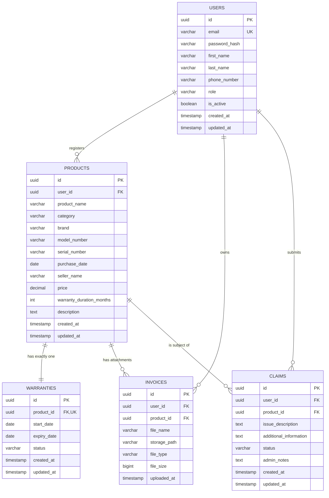
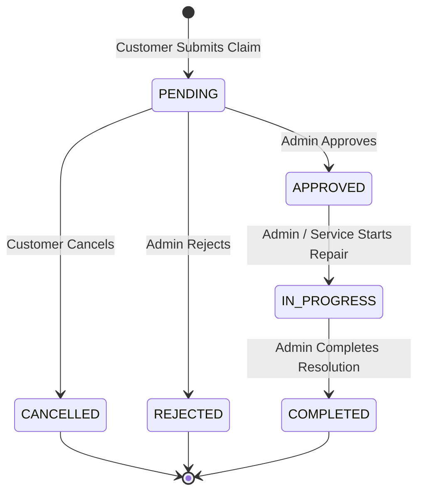

# Product Warranty Registration Portal (WarrantyHub)
## System Requirements & Architecture Specification
**Document Version:** 1.0.0  
**Status:** Approved for Phase 1  
**Project Phase:** Phase 1 — Project Planning & Requirements  
**Brand Name:** WarrantyHub  
**Tagline:** *"Your Warranties. Organized. Protected. Always Accessible."*  

---

## 1. Project Title & Overview

### 1.1 Formal Title
**Product Warranty Registration Portal**

### 1.2 Short Brand Name
**WarrantyHub**

### 1.3 Tagline
> *"Your Warranties. Organized. Protected. Always Accessible."*

### 1.4 Executive Summary
WarrantyHub is a centralized, cloud-enabled web platform engineered to eliminate the friction and vulnerability of physical warranty and invoice management. By digitizing product registrations, automating warranty period calculations, securing invoices in cloud object storage, and providing structured warranty claim workflows, WarrantyHub bridges the gap between consumers and post-purchase product protection.

---

## 2. Project Objective

The primary objective of WarrantyHub is to establish a secure, multi-tenant capable, role-based digital portal serving two key groups: **Customers** and **Platform Administrators**.

### 2.1 Customer Objectives
1. **Account Registration & Secure Authentication:** Enable customers to self-register and securely authenticate using JSON Web Tokens (JWT) and industry-standard password hashing.
2. **Product Lifecycle Registration:** Capture detailed product purchases (brand, model, serial number, purchase date, price, seller).
3. **Automated Warranty Lifecycle Management:** Automatically generate warranty tracking records derived from purchase dates and warranty duration periods without manual user calculation.
4. **Digital Invoice Vault:** Securely upload, view, download, and manage digital proofs of purchase (PDF, JPG, PNG) up to 10 MB per file.
5. **Real-time Status & Expiry Tracking:** Continuously calculate warranty validity (`ACTIVE`, `EXPIRING_SOON`, `EXPIRED`) with configurable proactive warnings (30 days prior to expiration).
6. **Self-Service Warranty Claims:** Allow customers to submit formal warranty claims directly against registered products and monitor real-time review progress.
7. **Profile & Notification Management:** Offer dedicated account controls and contextual alerts for upcoming expirations and claim updates.

### 2.2 Administrator Objectives
1. **User Oversight:** Inspect registered customer accounts and their respective resource counts.
2. **Product & Warranty Registry:** Search, filter, and audit all registered customer products and warranty records across the system.
3. **Invoice Verification:** Inspect and verify uploaded purchase documents for authenticity.
4. **Claim Adjudication Workflow:** Review pending warranty claims, inspect issue descriptions, and transition claim states (`APPROVED`, `REJECTED`, `IN_PROGRESS`, `COMPLETED`).
5. **Operational Telemetry:** Monitor system-wide KPIs including total active warranties, pending claim backlogs, and user registration trends.

---

## 3. Problem Statement

Consumers face recurring challenges in preserving post-purchase consumer rights:
- **Physical Document Loss:** Paper receipts, thermal printouts that fade over time, and physical warranty cards are frequently misplaced, damaged, or lost.
- **Expiry Blindspots:** Consumers rarely track the exact end dates of product warranties, missing legitimate claim windows before discovering a defect.
- **Scattered Proof of Purchase:** Invoices reside in email inboxes, messaging apps, or physical folders, making retrieval stressful during urgent product breakdowns.
- **Unclear Warranty Claim States:** When filing claims through informal seller channels, consumers lack transparency regarding claim progress, review stages, and formal resolution tracking.
- **Administrative Inefficiency:** Businesses and administrators lack a structured database to verify product serial numbers, validate original invoice attachments, and record legitimate claim resolutions.

---

## 4. Proposed Solution

WarrantyHub resolves these issues through a structured, full-stack digital solution:
- **Unified Post-Purchase Dashboard:** A single-pane-of-glass dashboard displaying real-time metrics, active warranties, expiring items, and open claims.
- **Automated Expiry Computation:** Zero-touch warranty record generation calculating the precise expiration date (`purchase_date + warranty_duration_months`) immediately upon product registration.
- **Secure Cloud Object Storage:** Cloud-hosted, tamper-resistant storage for invoice files via Supabase Storage, linking digital assets to user and product identifiers.
- **State-Driven Claims Engine:** A deterministic state machine governing claim workflows with clear customer-facing feedback and administrative decision controls.
- **Strict Role-Based Access Control (RBAC):** Hardware-level data isolation ensuring customers can only access their own records (preventing Insecure Direct Object References - IDOR), while privileged administrators retain oversight.

---

## 5. Target Users & Personas

### 5.1 Persona Matrix

| Role | Target User | Primary Goals | Pain Points Addressed |
| :--- | :--- | :--- | :--- |
| **CUSTOMER** | Everyday consumers, gadget owners, household managers | Centralize receipts, track warranties, file claims without hassle | Lost paper receipts, forgotten expiry dates, confusing claim processes |
| **ADMIN** | Support staff, warranty managers, operations admins | Audit products, verify invoices, adjudicate claims, track operational health | Disorganized claim queues, fraudulent or unverifiable claims, lack of centralized records |

### 5.2 User Roles & Permissions Summary

```
                  ┌────────────────────────────────────────┐
                  │              WarrantyHub               │
                  └───────────────────┬────────────────────┘
                                      │
                 ┌────────────────────┴────────────────────┐
                 ▼                                         ▼
      ┌──────────────────────┐                  ┌──────────────────────┐
      │   CUSTOMER (User)    │                  │      ADMINISTRATOR   │
      └──────────┬───────────┘                  └──────────┬───────────┘
                 │                                         │
                 ├─ Register & Login                       ├─ Manage Platform Users
                 ├─ Manage Own Products                    ├─ Audit All Products
                 ├─ View Own Warranties                    ├─ Monitor All Warranties
                 ├─ Upload/Download Own Invoices           ├─ Verify & Audit Invoices
                 ├─ Submit & Cancel Claims                 ├─ Adjudicate Claims
                 └─ View Personal Metrics                  └─ View Global Analytics
```

---

## 6. Customer Features Specification

### 6.1 Authentication & Profile
- Self-service account registration with email validation and secure password constraints.
- Secure login with JWT generation and persistent local session management.
- User profile view and update (name, phone number, communication preferences).
- Password change functionality with current-password verification.

### 6.2 Product Registration & Management
- Multi-field product entry: Name, Category, Brand, Model Number, Serial Number, Purchase Date, Seller Name, Purchase Price, Warranty Duration (months), and Optional Description.
- Real-time form validation ensuring purchase date is not in the future and duration is positive.
- Paginated listing of registered products with quick search and category filters.
- Detailed product view linking directly to the associated warranty, attached invoice, and any related claims.
- Edit capabilities for product metadata (excluding critical historical audit fields where restricted).
- Deletion of product records with cascading or restricted integrity rules depending on active claims.

### 6.3 Automated Warranty Tracking
- Instantaneous creation of a linked warranty entity upon product submission.
- Dynamic calculation of expiry date: `purchase_date + warranty_duration_months`.
- Automatic status evaluation:
  - `ACTIVE`: Current date is before expiry and greater than 30 days remaining.
  - `EXPIRING_SOON`: Expiry date is within 30 days from the current date.
  - `EXPIRED`: Current date has passed the calculated expiry date.
- Days-remaining countdown badge displayed across cards and tables.

### 6.4 Invoice Vault
- Direct file upload supporting PDF, JPG, JPEG, and PNG (maximum 10 MB per file).
- Clear file upload progress indicators.
- In-browser preview modal for image/PDF formats.
- Secure one-click file download using signed/authenticated URLs.
- Secure deletion of invoice metadata and corresponding Supabase Storage object.

### 6.5 Warranty Claim Submission & Tracking
- Formal claim creation against any active registered product.
- Mandatory issue description detailing the malfunction, error codes, or physical defects.
- Optional field for supplementary context (seller correspondence, troubleshooting steps taken).
- Claim lifecycle tracker visualizing state: `PENDING` $\rightarrow$ `APPROVED` $\rightarrow$ `IN_PROGRESS` $\rightarrow$ `COMPLETED`.
- Option to self-cancel claims while still in the `PENDING` state.
- Real-time status update notices.

### 6.6 Notifications & Alerts
- In-app notification bell indicating:
  - Upcoming warranty expirations (30-day and 7-day warnings).
  - Claim status updates (e.g., claim approved, in review, or resolved).
- Centralized notification center page with read/unread toggle.

---

## 7. Admin Features Specification

### 7.1 Administrative Dashboard
- Global operational KPIs: Total Users, Total Products Registered, Active Warranties, Expired Warranties, Pending Claims, Completed Claims.
- Actionable alert widgets: Pending Claim Queue requiring review.

### 7.2 User Management
- Comprehensive directory of registered customers.
- User detail inspection: registration timestamp, contact info, total products registered, active warranty count, and historical claim counts.
- Account status management (Active / Suspended).

### 7.3 System-Wide Product & Warranty Audit
- Global search by serial number, brand, model number, or customer email.
- Complete visibility into product details, purchase proof, and warranty status across all users.
- Exportable summaries for compliance and auditing.

### 7.4 Claim Adjudication Workflow
- Dedicated claim review queue sorting pending claims by submission date.
- Side-by-side inspection view: Claim Description + Registered Product Details + Linked Invoice Document.
- Status update action panel:
  - Approve Claim (`PENDING` $\rightarrow$ `APPROVED`)
  - Reject Claim (`PENDING` $\rightarrow$ `REJECTED`) with mandatory administrator reason.
  - Mark In Progress (`APPROVED` $\rightarrow$ `IN_PROGRESS`).
  - Mark Completed (`IN_PROGRESS` $\rightarrow$ `COMPLETED`) with resolution notes.

---

## 8. Technology Stack

| Tier / Component | Technology Selected | Version / Specification | Rationale & Responsibility |
| :--- | :--- | :--- | :--- |
| **Frontend Framework** | React.js | 18.x | Component-driven, declarative user interface |
| **Build Tool** | Vite | 5.x | High-speed HMR, optimized production asset bundling |
| **Language (FE)** | JavaScript (ESNext) | Modern ECMAScript | Rapid frontend feature iteration |
| **Routing** | React Router | 6.x | Client-side routing with nested layouts and route guards |
| **HTTP Client** | Axios | 1.x | Configurable interceptors for JWT token attachment and 401 handling |
| **Styling & UI** | Vanilla CSS / Design Tokens | Modern CSS (Grid/Flex/Custom Props) | Pixel-perfect control matching Google Stitch specifications |
| **Icons** | Lucide React | Latest | Clean, consistent SaaS iconography |
| **Backend Framework** | Spring Boot | 3.2.x | Enterprise-grade Java framework with high reliability |
| **Language (BE)** | Java | **Java 17 (LTS)** | Modern language features (records, pattern matching, sealed classes) |
| **Security Framework** | Spring Security | 6.x (via Boot 3.2) | Method-level security, stateless filter chain, authorization rules |
| **Token Standard** | JJWT (io.jsonwebtoken) | 0.12.x | Secure signing and parsing of JSON Web Tokens |
| **Data Persistence** | Spring Data JPA / Hibernate | 6.x | Standardized ORM repository abstraction and entity lifecycle |
| **Build Tool (BE)** | Apache Maven | 3.9.x | Dependency management, build lifecycle, and test automation |
| **Database** | PostgreSQL | 15.x+ (via Supabase) | ACID-compliant relational data store with robust JSON/indexing support |
| **File Storage** | Supabase Storage | S3-compatible Object Storage | Secure, scalable storage for customer invoice attachments |
| **Unit & Integration Testing** | JUnit 5 & Mockito | Latest via Spring Boot Starter Test | Comprehensive service-level and controller-level test coverage |
| **API Testing** | Postman / REST Client | Standard | Endpoint verification, regression test collections |
| **IDE & Development** | Antigravity IDE | Latest | AI-accelerated development and workspace orchestration |

> [!IMPORTANT]
> **Java 17 Constraint:** Java 17 LTS is strictly mandated across the backend codebase and runtime environment. Language level features, Spring Boot 3.2 baseline, and compiler configurations will be aligned to Java 17.

---

## 9. Database Entities & Relational Design

The relational schema is designed for 3NF normalization, referential integrity, and performant query indexing.

### 9.1 Entity Relationship Diagram



### 9.2 Data Dictionary & Entity Attributes

#### Table 1: `users`
| Column Name | Data Type | Constraints | Description |
| :--- | :--- | :--- | :--- |
| `id` | `UUID` | PRIMARY KEY, DEFAULT `gen_random_uuid()` | Unique user identifier |
| `email` | `VARCHAR(255)` | NOT NULL, UNIQUE, INDEX | Customer or admin email address |
| `password_hash` | `VARCHAR(255)` | NOT NULL | BCrypt hashed password |
| `first_name` | `VARCHAR(100)` | NOT NULL | User's legal first name |
| `last_name` | `VARCHAR(100)` | NOT NULL | User's legal surname |
| `phone_number` | `VARCHAR(25)` | NULLABLE | Contact telephone number |
| `role` | `VARCHAR(30)` | NOT NULL, DEFAULT `'CUSTOMER'` | Security role: `'CUSTOMER'`, `'ADMIN'` |
| `is_active` | `BOOLEAN` | NOT NULL, DEFAULT `true` | Account active flag |
| `created_at` | `TIMESTAMP WITH TIME ZONE` | NOT NULL, DEFAULT `NOW()` | Record creation timestamp |
| `updated_at` | `TIMESTAMP WITH TIME ZONE` | NOT NULL, DEFAULT `NOW()` | Record last updated timestamp |

#### Table 2: `products`
| Column Name | Data Type | Constraints | Description |
| :--- | :--- | :--- | :--- |
| `id` | `UUID` | PRIMARY KEY, DEFAULT `gen_random_uuid()` | Unique product identifier |
| `user_id` | `UUID` | NOT NULL, FK $\rightarrow$ `users(id)` ON DELETE CASCADE | Owning user ID |
| `product_name` | `VARCHAR(255)` | NOT NULL | Display name of the product |
| `category` | `VARCHAR(100)` | NOT NULL, INDEX | Product category (Electronics, Appliance, etc.) |
| `brand` | `VARCHAR(100)` | NOT NULL, INDEX | Manufacturer brand name |
| `model_number` | `VARCHAR(100)` | NULLABLE | Manufacturer model identifier |
| `serial_number` | `VARCHAR(150)` | NOT NULL, INDEX | Serial number of physical unit |
| `purchase_date` | `DATE` | NOT NULL | Official date of purchase on receipt |
| `seller_name` | `VARCHAR(255)` | NOT NULL | Retailer or merchant vendor name |
| `price` | `NUMERIC(12,2)` | NOT NULL | Purchase price in registered currency |
| `warranty_duration_months`| `INTEGER` | NOT NULL | Duration of warranty coverage in months |
| `description` | `TEXT` | NULLABLE | User notes or item condition details |
| `created_at` | `TIMESTAMP WITH TIME ZONE` | NOT NULL, DEFAULT `NOW()` | Record creation timestamp |
| `updated_at` | `TIMESTAMP WITH TIME ZONE` | NOT NULL, DEFAULT `NOW()` | Record last updated timestamp |

#### Table 3: `warranties`
| Column Name | Data Type | Constraints | Description |
| :--- | :--- | :--- | :--- |
| `id` | `UUID` | PRIMARY KEY, DEFAULT `gen_random_uuid()` | Unique warranty record identifier |
| `product_id` | `UUID` | NOT NULL, UNIQUE, FK $\rightarrow$ `products(id)` ON DELETE CASCADE | 1-to-1 relationship with product |
| `start_date` | `DATE` | NOT NULL | Effective coverage start date (`purchase_date`) |
| `expiry_date` | `DATE` | NOT NULL, INDEX | Automatically calculated expiration date |
| `status` | `VARCHAR(30)` | NOT NULL, INDEX | `'ACTIVE'`, `'EXPIRING_SOON'`, `'EXPIRED'` |
| `created_at` | `TIMESTAMP WITH TIME ZONE` | NOT NULL, DEFAULT `NOW()` | Record creation timestamp |
| `updated_at` | `TIMESTAMP WITH TIME ZONE` | NOT NULL, DEFAULT `NOW()` | Record last updated timestamp |

#### Table 4: `invoices`
| Column Name | Data Type | Constraints | Description |
| :--- | :--- | :--- | :--- |
| `id` | `UUID` | PRIMARY KEY, DEFAULT `gen_random_uuid()` | Unique invoice metadata record identifier |
| `user_id` | `UUID` | NOT NULL, FK $\rightarrow$ `users(id)` ON DELETE CASCADE | Owning user ID |
| `product_id` | `UUID` | NOT NULL, FK $\rightarrow$ `products(id)` ON DELETE CASCADE | Related registered product |
| `file_name` | `VARCHAR(255)` | NOT NULL | Original sanitized file name |
| `storage_path` | `VARCHAR(500)` | NOT NULL, UNIQUE | Object storage key in Supabase bucket |
| `file_type` | `VARCHAR(100)` | NOT NULL | MIME type (`application/pdf`, `image/jpeg`, etc.) |
| `file_size` | `BIGINT` | NOT NULL | File size in bytes (max 10,485,760 bytes) |
| `uploaded_at` | `TIMESTAMP WITH TIME ZONE` | NOT NULL, DEFAULT `NOW()` | Upload timestamp |

#### Table 5: `claims`
| Column Name | Data Type | Constraints | Description |
| :--- | :--- | :--- | :--- |
| `id` | `UUID` | PRIMARY KEY, DEFAULT `gen_random_uuid()` | Unique claim identifier |
| `user_id` | `UUID` | NOT NULL, FK $\rightarrow$ `users(id)` ON DELETE CASCADE | Submitting customer ID |
| `product_id` | `UUID` | NOT NULL, FK $\rightarrow$ `products(id)` ON DELETE RESTRICT | Target product under claim |
| `issue_description` | `TEXT` | NOT NULL | Comprehensive explanation of failure/defect |
| `additional_information`| `TEXT` | NULLABLE | Supplemental context (e.g., error codes, troubleshooting) |
| `status` | `VARCHAR(30)` | NOT NULL, INDEX, DEFAULT `'PENDING'` | `'PENDING'`, `'APPROVED'`, `'REJECTED'`, `'IN_PROGRESS'`, `'COMPLETED'`, `'CANCELLED'` |
| `admin_notes` | `TEXT` | NULLABLE | Adjudication justification or instructions |
| `created_at` | `TIMESTAMP WITH TIME ZONE` | NOT NULL, DEFAULT `NOW()` | Submission timestamp |
| `updated_at` | `TIMESTAMP WITH TIME ZONE` | NOT NULL, DEFAULT `NOW()` | Status transition timestamp |

---

## 10. Main Application Flow

### 10.1 Customer Journey Flowchart

```
┌─────────────┐
│ Landing Page│
└──────┬──────┘
       ▼
┌─────────────┐
│  Register   │ ──(Email & Password)──► [Create Account]
└──────┬──────┘
       ▼
┌─────────────┐
│    Login    │ ──(JWT Issued)────────► [Authenticated Session]
└──────┬──────┘
       ▼
┌──────────────────┐
│Customer Dashboard│ ◄─── Overview Metrics, Expiring Items, Recent Claims
└──────┬───────────┘
       ├───────────────────────────────────────────────┐
       ▼                                               ▼
┌────────────────────────┐                    ┌────────────────────────┐
│    Register Product    │                    │     View Documents     │
└──────┬─────────────────┘                    └────────────────────────┘
       ▼
[Auto-Compute Warranty:  ]
[start_date = purchase   ]
[expiry = start + months ]
       ▼
┌────────────────────────┐
│     Upload Invoice     │ ──(Upload to Supabase Storage)──► [Link Invoice Record]
└──────┬─────────────────┘
       ▼
┌────────────────────────┐
│ Track Warranty Details │ ──(Monitor Countdown & Status Badges)
└──────┬─────────────────┘
       ▼
┌────────────────────────┐
│ Submit Warranty Claim  │ ──(Describe Defect)──► [Status: PENDING]
└──────┬─────────────────┘
       ▼
┌────────────────────────┐
│   Track Claim Status   │ ◄─── Customer monitors APPROVED / IN_PROGRESS / COMPLETED
└────────────────────────┘
```

### 10.2 Administrator Journey Flowchart

```
┌─────────────┐
│ Admin Login │ ──(Verify ROLE_ADMIN)
└──────┬──────┘
       ▼
┌──────────────────┐
│ Admin Dashboard  │ ◄─── Global System KPIs, Open Claim Backlog, Audit Counts
└──────┬───────────┘
       ├─────────────────┬──────────────────┬─────────────────┐
       ▼                 ▼                  ▼                 ▼
┌──────────────┐  ┌──────────────┐   ┌──────────────┐  ┌──────────────┐
│ Manage Users │  │Audit Products│   │Audit Invoices│  │Review Claims │
└──────────────┘  └──────────────┘   └──────────────┘  └──────┬───────┘
                                                              ▼
                                                     [Inspect Invoice & Details]
                                                              │
                                        ┌─────────────────────┴─────────────────────┐
                                        ▼                                           ▼
                                 [Approve Claim]                             [Reject Claim]
                                        │                                           │
                                        ▼                                           ▼
                                 [IN_PROGRESS]                               [Status: REJECTED]
                                        │
                                        ▼
                                 [COMPLETED]
```

---

## 11. Warranty Logic & Business Rules

### 11.1 Calculation Formula
Warranty periods are derived strictly from the product purchase date and the duration specified in months:
$$\text{start\_date} = \text{purchase\_date}$$
$$\text{expiry\_date} = \text{purchase\_date} + \text{warranty\_duration\_months}$$

**Concrete Example:**
- `purchase_date`: `2026-09-20`
- `warranty_duration_months`: `24`
- `expiry_date`: `2028-09-20`

### 11.2 Status Evaluation Rules
Status is calculated deterministically based on the system date ($T_{\text{today}}$):

```
                       ┌─────────────────────────────────┐
                       │   T_today > expiry_date ?       │
                       └───────────────┬─────────────────┘
                                       │
                      YES ─────────────┴───────────── NO
                       │                              │
                       ▼                              ▼
                 ┌──────────┐          ┌───────────────────────────────┐
                 │ EXPIRED  │          │ (expiry_date - T_today) <= 30?│
                 └──────────┘          └──────────────┬────────────────┘
                                                      │
                                     YES ─────────────┴───────────── NO
                                      │                              │
                                      ▼                              ▼
                              ┌───────────────┐               ┌──────────┐
                              │ EXPIRING_SOON │               │  ACTIVE  │
                              └───────────────┘               └──────────┘
```

1. **`EXPIRED`**: When $T_{\text{today}} > \text{expiry\_date}$.
2. **`EXPIRING_SOON`**: When $0 \le (\text{expiry\_date} - T_{\text{today}}) \le 30 \text{ days}$. (Configurable threshold parameter: `app.warranty.expiring-soon-threshold-days=30`).
3. **`ACTIVE`**: When $(\text{expiry\_date} - T_{\text{today}}) > 30 \text{ days}$.

### 11.3 Status Synchronization Architecture
- **Dynamic Calculation:** All GET requests dynamically re-evaluate status or return a computed transient status to ensure zero lag.
- **Scheduled Synchronization Job:** A Spring `@Scheduled` cron job runs daily at midnight (`0 0 0 * * *`) to update the persisted status flag in the database, triggering expiration alert notifications where appropriate.

---

## 12. Invoice Management Specification

### 12.1 Technical Constraints
- **Supported MIME Types:**
  - `application/pdf` (.pdf)
  - `image/jpeg` (.jpg, .jpeg)
  - `image/png` (.png)
- **Maximum File Size:** 10 MB ($10 \times 1,024 \times 1,024 = 10,485,760 \text{ bytes}$). Enforced both at frontend file picker and Spring Boot multipart resolver (`spring.servlet.multipart.max-file-size=10MB`).
- **File Name Sanitization:** Special characters, directory traversal sequences (`..`), and non-ASCII characters will be stripped before storage.

### 12.2 Storage Provider & Path Convention
Invoice files are stored within a dedicated private bucket in **Supabase Storage** named `invoices`.
- **Path Schema:**  
  `invoices/{userId}/{productId}/{uuid}_{sanitizedFileName}`
- **Example:**  
  `invoices/a4f3c7e0-1234-4b5a-9876-000000000001/f9b8c7d6-5432-4a1b-8765-000000000002/d7c2a1e8-7890-4c3b-b654-111111111111_BestBuy_Receipt.pdf`

### 12.3 Download & Security Handling
- Invoice files are non-public. Direct bucket access without authentication is disallowed.
- File downloads are brokered through an authenticated backend endpoint (`GET /api/invoices/{id}/download`) or via short-lived signed URLs generated server-side using the Supabase Service Key.
- Ownership validation verifies that `invoice.user_id == authenticated_user.id` or `authenticated_user.hasRole('ADMIN')`.

---

## 13. Warranty Claim Workflow & Business Rules

### 13.1 Claim State Machine



### 13.2 State Transition Matrix & Rules

| From State | To State | Initiator | Condition / Rule |
| :--- | :--- | :--- | :--- |
| *None* | `PENDING` | Customer | Linked warranty must not be `EXPIRED`. Active product must belong to customer. |
| `PENDING` | `CANCELLED` | Customer | Only allowed while status is strictly `PENDING`. |
| `PENDING` | `APPROVED` | Admin | Requires admin inspection of invoice and warranty validity. |
| `PENDING` | `REJECTED` | Admin | Mandatory rejection reason provided in `admin_notes`. |
| `APPROVED` | `IN_PROGRESS` | Admin | Repair or unit replacement dispatched. |
| `IN_PROGRESS` | `COMPLETED` | Admin | Resolution documented in `admin_notes`. Terminal state. |

---

## 14. Authentication & Security Architecture

### 14.1 Security Design Principles
- **Stateless Authentication:** Spring Security configured with `SessionCreationPolicy.STATELESS`.
- **Password Protection:** Passwords hashed using BCrypt (`BCryptPasswordEncoder` with strength factor 12).
- **JWT Standard:** Tokens signed using HMAC-SHA256 (`HS256`) with a cryptographically secure 256+ bit secret key stored outside source control.
- **Role Isolation:** Two distinct roles:
  - `ROLE_CUSTOMER`
  - `ROLE_ADMIN`
- **Ownership Validation (IDOR Prevention):** Every service method verifies entity ownership before returning or modifying data:
  ```java
  if (!entity.getUserId().equals(currentUser.getId()) && !currentUser.isAdmin()) {
      throw new AccessDeniedException("Unauthorized access to resource");
  }
  ```
- **Service Role Key Shielding:** The Supabase `service_role` secret key is strictly restricted to the Spring Boot backend environment and will never be shared with or bundled into frontend JavaScript files.

### 14.2 Environment Configuration Management
- Secrets are sourced strictly via system environment variables or `.env` files parsed during local startup.
- `.gitignore` will explicitly include:
  ```
  .env
  .env.local
  *.env
  ```
- A `.env.example` template will be maintained in the root, backend, and frontend directories containing dummy placeholders for team onboarding.

---

## 15. Frontend Route Plan

All routes will be orchestrated using React Router v6, segregated into **Public**, **Customer (Protected)**, **Admin (Protected)**, and **System** routes.

### 15.1 Route Inventory

| Path | Layout / Guard | Page / View Name | Purpose |
| :--- | :--- | :--- | :--- |
| `/` | Public Layout | `LandingPage` | Brand presentation, value proposition, features overview |
| `/login` | Auth Layout | `LoginPage` | User login form (JWT authentication) |
| `/register` | Auth Layout | `RegisterPage` | Customer self-registration form |
| `/forgot-password` | Auth Layout | `ForgotPasswordPage` | Password recovery request initiation |
| `/reset-password` | Auth Layout | `ResetPasswordPage` | Token-based password reset form |
| `/dashboard` | Customer Layout (Protected) | `CustomerDashboard` | Metrics, expiring warranties, recent items & claims |
| `/products` | Customer Layout (Protected) | `ProductListPage` | Paginated grid/table of registered products |
| `/products/register` | Customer Layout (Protected) | `RegisterProductPage` | Multi-step/structured product registration form |
| `/products/:id` | Customer Layout (Protected) | `ProductDetailPage` | Product specs, linked warranty, invoice, claim history |
| `/products/:id/edit` | Customer Layout (Protected) | `EditProductPage` | Update product metadata |
| `/warranties` | Customer Layout (Protected) | `WarrantyListPage` | All warranties with status filters (Active, Expiring, Expired) |
| `/warranties/:id` | Customer Layout (Protected) | `WarrantyDetailPage`| Detailed warranty validity, countdown timer, and claim link |
| `/invoices` | Customer Layout (Protected) | `InvoiceVaultPage` | Grid of stored purchase invoices with preview modal |
| `/invoices/upload` | Customer Layout (Protected) | `UploadInvoicePage` | Dedicated drag-and-drop invoice upload view |
| `/invoices/:id` | Customer Layout (Protected) | `InvoiceDetailPage` | Document metadata and viewer |
| `/claims` | Customer Layout (Protected) | `ClaimListPage` | Historical and ongoing warranty claims |
| `/claims/create` | Customer Layout (Protected) | `CreateClaimPage` | Claim submission form linked to selected product |
| `/claims/:id` | Customer Layout (Protected) | `ClaimDetailPage` | Claim status tracker, timeline, and cancellation option |
| `/profile` | Customer Layout (Protected) | `ProfilePage` | Personal info management and contact details |
| `/settings` | Customer Layout (Protected) | `SettingsPage` | Notification preferences, password change |
| `/notifications` | Customer Layout (Protected) | `NotificationPage` | System alerts, expiration notices, claim updates |
| `/admin/dashboard` | Admin Layout (AdminGuard) | `AdminDashboard` | Platform telemetry, pending queue, overview metrics |
| `/admin/users` | Admin Layout (AdminGuard) | `AdminUsersPage` | User directory and account status controls |
| `/admin/users/:id` | Admin Layout (AdminGuard) | `AdminUserDetailPage`| Deep inspection of individual user's data |
| `/admin/products` | Admin Layout (AdminGuard) | `AdminProductsPage` | Global product audit registry |
| `/admin/products/:id` | Admin Layout (AdminGuard) | `AdminProductDetailPage` | Detailed inspection of any product |
| `/admin/warranties` | Admin Layout (AdminGuard) | `AdminWarrantiesPage` | System-wide warranty monitor |
| `/admin/invoices` | Admin Layout (AdminGuard) | `AdminInvoicesPage` | Global invoice audit and verification |
| `/admin/claims` | Admin Layout (AdminGuard) | `AdminClaimsPage` | Adjudication queue for all customer claims |
| `/admin/claims/:id` | Admin Layout (AdminGuard) | `AdminClaimDetailPage` | Side-by-side claim adjudication and status transition |
| `/admin/settings` | Admin Layout (AdminGuard) | `AdminSettingsPage` | Configurable system thresholds (e.g., expiring days) |
| `/403` | Minimal Layout | `UnauthorizedPage` | Access denied notification |
| `/404` | Minimal Layout | `NotFoundPage` | Resource or route not found |
| `/500` | Minimal Layout | `ServerErrorPage` | Unexpected application error |

---

## 16. Backend REST API Plan

All backend APIs will adhere to RESTful conventions, returning standardized JSON responses, appropriate HTTP status codes, and uniform error schemas.

### 16.1 Standard Response Envelope Format
```json
{
  "success": true,
  "data": {},
  "message": "Operation completed successfully",
  "timestamp": "2026-09-20T13:43:00Z"
}
```

### 16.2 Endpoint Inventory

#### 16.2.1 Authentication Module (`/api/auth`)
| Method | Endpoint | Access | Request Body | Description |
| :--- | :--- | :--- | :--- | :--- |
| `POST` | `/api/auth/register` | Public | `RegisterRequestDTO` | Register customer account |
| `POST` | `/api/auth/login` | Public | `LoginRequestDTO` | Authenticate credentials & return JWT |
| `GET` | `/api/auth/me` | Authenticated | *None* | Get current user profile and role |

#### 16.2.2 Products Module (`/api/products`)
| Method | Endpoint | Access | Request Body / Query Params | Description |
| :--- | :--- | :--- | :--- | :--- |
| `POST` | `/api/products` | Customer | `CreateProductDTO` | Register new product & auto-create warranty |
| `GET` | `/api/products` | Customer | `?page=0&size=10&search=&category=` | Get paginated list of user's products |
| `GET` | `/api/products/{id}` | Customer | *None* | Get single product details by ID |
| `PUT` | `/api/products/{id}` | Customer | `UpdateProductDTO` | Update product details |
| `DELETE`| `/api/products/{id}` | Customer | *None* | Delete product (and linked warranties/invoices) |

#### 16.2.3 Warranties Module (`/api/warranties`)
| Method | Endpoint | Access | Query Params | Description |
| :--- | :--- | :--- | :--- | :--- |
| `GET` | `/api/warranties` | Customer | `?status=ACTIVE,EXPIRING_SOON` | Get all warranties for current user |
| `GET` | `/api/warranties/{id}` | Customer | *None* | Get single warranty details by ID |

#### 16.2.4 Invoices Module (`/api/invoices`)
| Method | Endpoint | Access | Request Type | Description |
| :--- | :--- | :--- | :--- | :--- |
| `POST` | `/api/invoices/upload` | Customer | `multipart/form-data` (`file`, `productId`) | Upload invoice file to Supabase & save metadata |
| `GET` | `/api/invoices` | Customer | `?productId=` | List user's invoices (optional product filter) |
| `GET` | `/api/invoices/{id}` | Customer | *None* | Get invoice metadata by ID |
| `GET` | `/api/invoices/{id}/download` | Customer / Admin | *None* | Secure download stream or signed redirect URL |
| `DELETE`| `/api/invoices/{id}` | Customer | *None* | Delete invoice file from Supabase & purge record |

#### 16.2.5 Warranty Claims Module (`/api/claims`)
| Method | Endpoint | Access | Request Body | Description |
| :--- | :--- | :--- | :--- | :--- |
| `POST` | `/api/claims` | Customer | `CreateClaimDTO` | Submit a new claim for an active product |
| `GET` | `/api/claims` | Customer | `?page=0&size=10&status=` | List all claims submitted by current user |
| `GET` | `/api/claims/{id}` | Customer | *None* | Get detailed claim status and notes |
| `PUT` | `/api/claims/{id}/cancel` | Customer | *None* | Cancel an eligible pending claim |

#### 16.2.6 Admin Module (`/api/admin`)
| Method | Endpoint | Access | Query / Request Body | Description |
| :--- | :--- | :--- | :--- | :--- |
| `GET` | `/api/admin/dashboard-stats` | Admin | *None* | Get global telemetry & KPI summary |
| `GET` | `/api/admin/users` | Admin | `?page=0&size=20&search=` | List all registered users |
| `GET` | `/api/admin/users/{id}` | Admin | *None* | Get full user profile and asset history |
| `GET` | `/api/admin/products` | Admin | `?page=0&size=20&search=` | Audit all products registered across platform |
| `GET` | `/api/admin/warranties` | Admin | `?status=` | System-wide warranty monitor |
| `GET` | `/api/admin/invoices` | Admin | `?page=0&size=20` | Audit all uploaded invoice records |
| `GET` | `/api/admin/claims` | Admin | `?status=PENDING` | View all submitted claims queue |
| `PUT` | `/api/admin/claims/{id}/status` | Admin | `UpdateClaimStatusDTO` | Adjudicate claim (`APPROVED`, `REJECTED`, etc.) |

---

## 17. High-Level Architecture & Layering

### 17.1 System Component Topology

```
+-------------------------------------------------------------+
|                     Client Presentation                     |
|                 React.js 18 + Vite + Axios                  |
+------------------------------+------------------------------+
                               |
                               | HTTPS / REST (JSON)
                               | Bearer JWT
                               v
+-------------------------------------------------------------+
|                      Spring Boot 3.2                        |
|                                                             |
|  +-------------------------------------------------------+  |
|  |             Spring Security Filter Chain              |  |
|  |           (JwtAuthFilter -> SecurityContext)          |  |
|  +---------------------------+---------------------------+  |
|                              |                              |
|                              v                              |
|  +-------------------------------------------------------+  |
|  |                   REST Controllers                    |  |
|  |        (AuthController, ProductController, etc.)      |  |
|  +---------------------------+---------------------------+  |
|                              |                              |
|                              v                              |
|  +-------------------------------------------------------+  |
|  |                     Service Layer                     |  |
|  |        (Business Rules, Ownership Verification,       |  |
|  |         Warranty Computation, Storage Client)         |  |
|  +-------------------+-------------------+---------------+  |
|                      |                   |                  |
+----------------------|-------------------|------------------+
                       |                   |
        JPA/Hibernate  |                   | Supabase Storage API
                       v                   v
        +-----------------------+ +-----------------------+
        |   PostgreSQL Database | |   Supabase Storage    |
        |      (Via Supabase)   | |    (Invoice Bucket)   |
        +-----------------------+ +-----------------------+
```

### 17.2 Backend Layered Architecture Responsibilities
1. **Controller Layer:** Handles HTTP requests, request parameter deserialization, input validation (`@Valid`), and produces HTTP responses (`ResponseEntity<ApiResponse<T>>`).
2. **Service Layer:** Implements core business logic, status calculation, transaction boundaries (`@Transactional`), and security ownership authorization.
3. **Repository Layer:** Spring Data JPA interfaces extending `JpaRepository` with custom derived queries and JPQL queries.
4. **Entity Model:** JPA `@Entity` classes mapping directly to PostgreSQL tables.
5. **DTO (Data Transfer Object) Pattern:** Clean separation between database schemas and network payloads to prevent over-posting and protect sensitive internals.
6. **Global Exception Handling:** `@RestControllerAdvice` translating exceptions into standardized HTTP error payloads.

---

## 18. Planned Folder Architecture

```
product-warranty-registration-portal/
├── backend/
│   ├── src/
│   │   ├── main/
│   │   │   ├── java/
│   │   │   │   └── com/
│   │   │   │       └── warrantyportal/
│   │   │   │           ├── WarrantyPortalApplication.java
│   │   │   │           ├── config/             # App, WebMvc, Swagger/OpenAPI configs
│   │   │   │           ├── controller/         # REST Controllers
│   │   │   │           ├── dto/                # Request and Response DTO records/classes
│   │   │   │           │   ├── request/
│   │   │   │           │   └── response/
│   │   │   │           ├── entity/             # JPA Entities
│   │   │   │           ├── enums/              # Status enums (Role, WarrantyStatus, ClaimStatus)
│   │   │   │           ├── exception/          # Custom exceptions & GlobalExceptionHandler
│   │   │   │           ├── repository/         # Spring Data JPA Repositories
│   │   │   │           ├── security/           # Spring Security, JWT Filter, UserDetails
│   │   │   │           └── service/            # Business logic interfaces and implementations
│   │   │   │               └── impl/
│   │   │   └── resources/
│   │   │       ├── application.properties      # Main application config
│   │   │       ├── application-dev.properties  # Development environment profile
│   │   │       └── application-prod.properties # Production environment profile
│   │   └── test/
│   │       └── java/
│   │           └── com/
│   │               └── warrantyportal/         # Unit and Integration test suites
│   ├── pom.xml                                 # Maven dependency and build config
│   ├── .env.example                            # Backend environment template
│   └── .env                                    # Ignored local environment variables
│
├── frontend/
│   ├── public/                                 # Static web assets and favicons
│   ├── src/
│   │   ├── assets/                             # Logos, branding graphics
│   │   ├── components/                         # Reusable UI components
│   │   │   ├── common/                         # Buttons, Inputs, Badges, Modals
│   │   │   ├── feedback/                       # Alerts, Spinners, Toast notifications
│   │   │   ├── layout/                         # Navbar, Sidebar, Footer, PageHeader
│   │   │   └── cards/                          # ProductCard, WarrantyCard, MetricCard
│   │   ├── context/                            # AuthContext, NotificationContext
│   │   ├── hooks/                              # Custom React hooks (useAuth, useFetch)
│   │   ├── layouts/                            # PublicLayout, CustomerLayout, AdminLayout
│   │   ├── pages/                              # Page-level route views
│   │   │   ├── auth/                           # Login, Register, ForgotPassword
│   │   │   ├── customer/                       # Dashboard, Products, Warranties, Claims
│   │   │   ├── admin/                          # AdminDashboard, Users, Adjudication
│   │   │   └── system/                         # 403, 404, 500 pages
│   │   ├── routes/                             # AppRoutes, RouteGuards (CustomerGuard, AdminGuard)
│   │   ├── services/                           # Axios API service instances and endpoints
│   │   ├── styles/                             # Global CSS, Design Tokens, Variables
│   │   ├── utils/                              # Formatters (currency, date), Validators
│   │   ├── App.jsx                             # Root React application
│   │   └── main.jsx                            # Vite entry point
│   ├── index.html                              # Main HTML template
│   ├── package.json                            # Frontend dependencies and scripts
│   ├── vite.config.js                          # Vite configuration
│   ├── .env.example                            # Frontend environment template
│   └── .env                                    # Ignored local environment variables
│
├── .gitignore                                  # Git exclusion definitions
├── PROJECT_REQUIREMENTS.md                     # Comprehensive Requirements Specification
└── README.md                                   # Project Overview & Phase Tracker
```

---

## 19. UI/UX Design Requirements

The frontend experience will adhere strictly to modern SaaS design language inspired by Google Stitch guidelines.

### 19.1 Visual Theme & Color Palette
- **Primary Accent:** Professional Blue/Indigo (`#2563EB` / `#4F46E5`), conveying trust, dependability, and precision.
- **Neutral Foundation:** Slate/Zinc (`#0F172A`, `#1E293B`, `#F8FAFC`), establishing crisp contrast and legibility.
- **Semantic Badges:**
  - `ACTIVE` / `APPROVED` / `COMPLETED`: Emerald Green (`#059669`, background `#ECFDF5`).
  - `EXPIRING_SOON` / `PENDING`: Amber / Warm Orange (`#D97706`, background `#FFFBEB`).
  - `EXPIRED` / `REJECTED`: Crimson Red (`#DC2626`, background `#FEF2F2`).
  - `IN_PROGRESS`: Sky Blue (`#0284C7`, background `#F0F9FF`).
  - `CANCELLED`: Slate Gray (`#64748B`, background `#F1F5F9`).

### 19.2 Typography & Spacing
- **Font Family:** Clean sans-serif via Google Fonts (`Inter` or `Outfit`).
- **Typographic Scale:** Strict hierarchy from `display` ($32\text{px}$), `h1` ($24\text{px}$), `h2` ($20\text{px}$), down to `body` ($14\text{px}$) and `caption` ($12\text{px}$).
- **Spacing Grid:** 4px/8px modular rhythm across padding, margins, and card gaps.

### 19.3 Mandatory State Handling Across All Views
Every primary page view must explicitly implement four standard states:
1. **Loading State:** Subtle skeleton placeholders mimicking actual content shapes (no abrupt layout shifts).
2. **Empty State:** High-clarity illustrated vectors with descriptive text and an immediate call-to-action button (e.g., *"No products registered yet. Add your first product to activate warranty protection."*).
3. **Error State:** User-friendly alert banners with actionable retry options and clear remediation context.
4. **Success State:** Toast notifications or modal confirmations providing immediate feedback on completed user actions (e.g., *"Product registered and warranty created successfully"*).

### 19.4 Aesthetics Guardrails
- **Avoid:** Excessive multi-color gradients, frosted glassmorphism overlays that impair readability, jarring animations, and nested card borders.
- **Emphasize:** Clean borders (`1px solid #E2E8F0`), subtle drop shadows (`0 1px 3px rgba(0,0,0,0.05)`), responsive layout adaptation across Mobile (<640px), Tablet (640px–1024px), and Desktop (>1024px).

---

## 20. Comprehensive Development Phases

```
+------------------------------------------------------------------------------------+
|                                 DEVELOPMENT PHASES                                 |
+------------------------------------------------------------------------------------+
|  [PHASE 1]  Project Planning & Requirements          <<< CURRENT PHASE (ACTIVE)    |
|  [PHASE 2]  Database Design & Supabase Setup                                       |
|  [PHASE 3]  Backend Initial Setup (Spring Boot 3.2 / Java 17)                      |
|  [PHASE 4]  Backend Authentication & Security Module                               |
|  [PHASE 5]  Frontend Initial Setup (React + Vite)                                  |
|  [PHASE 6]  Frontend Authentication & Route Guards                                 |
|  [PHASE 7]  Product Management Module                                              |
|  [PHASE 8]  Warranty Lifecycle Management Module                                   |
|  [PHASE 9]  Invoice Management & Storage Integration                               |
|  [PHASE 10] Warranty Claims Engine                                                 |
|  [PHASE 11] Admin Management Portal                                                |
|  [PHASE 12] Dashboard Analytics & Notification System                              |
|  [PHASE 13] Google Stitch UI Implementation & Polishing                            |
|  [PHASE 14] End-to-End Integration & Comprehensive Testing                         |
|  [PHASE 15] GitHub Repository Finalization & Technical Documentation               |
|  [PHASE 16] Production Deployment & Release                                        |
+------------------------------------------------------------------------------------+
```

### Phase Details

1. **Phase 1 — Project Planning & Requirements (Current):** Author full system requirements, database specifications, API contracts, and architecture design documents.
2. **Phase 2 — Database Design:** Author PostgreSQL schema DDL, create tables, indices, foreign key constraints, and configure the Supabase instance and invoice bucket.
3. **Phase 3 — Backend Initial Setup:** Initialize Maven project, Spring Boot 3.2, Java 17 baseline, layer packages, database connection pooling, and base entity configurations.
4. **Phase 4 — Backend Authentication:** Implement Spring Security, UserDetails, BCrypt hashing, JWT utility, auth filter, registration, login, and `/api/auth/me` endpoints.
5. **Phase 5 — Frontend Initial Setup:** Bootstrap Vite + React application, design token system, CSS foundations, base layout, and routing skeletons.
6. **Phase 6 — Frontend Authentication:** Auth context provider, login/register forms, Axios JWT interceptors, protected route guards.
7. **Phase 7 — Product Management:** Full CRUD APIs and frontend forms for product registration, editing, listing, and inspection.
8. **Phase 8 — Warranty Management:** Expiry date computation logic, status evaluation (`ACTIVE`, `EXPIRING_SOON`, `EXPIRED`), automated background status updates, and countdown views.
9. **Phase 9 — Invoice Management:** Supabase Storage integration, multipart upload endpoints, invoice metadata recording, preview modal, and secure download brokering.
10. **Phase 10 — Warranty Claims:** Claims state machine implementation, submission forms, cancelation logic, and status timeline tracking.
11. **Phase 11 — Admin Module:** Admin authorization checks, user directory, global product/warranty monitors, and claim adjudication interfaces.
12. **Phase 12 — Dashboard & Notifications:** KPI calculation engines for customer and admin dashboards, notification event triggers, and alert banners.
13. **Phase 13 — Stitch UI Implementation:** Polishing components according to Google Stitch principles, responsive adjustments, micro-interactions, and state transitions.
14. **Phase 14 — Integration & Testing:** Unit testing with JUnit/Mockito, integration test suites, Postman API collections, and browser-based flow verification.
15. **Phase 15 — GitHub & Documentation:** Environment template finalization, repository cleanup, API documentation, and code audit.
16. **Phase 16 — Deployment:** Production environment configuration, containerization/hosting deployment, and smoke testing.
